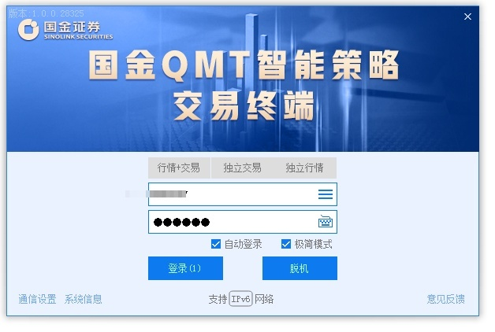

miniQMT属于QMT的一个子功能，一个精简功能下的自动交易框架，只支持实盘交易，不支持回测。在miniQMT模式下，你的策略代码将不在固定在自带的那个QMT软件下编写，而是可以自由地使用pycharm,vscode等编辑器，运行的时候直接使用 python xxxx.py 这样的形式启动。

它可以直接在外部调用python程序，不需要在券商的程序（QMT）内编写代码。

只是券商很少对它进行宣传，以至于用它的人不多。

进入miniQMT的方法： 点击QMT程序，登录时勾选极简模式




### 账号登录
```python
@api.route('/login', methods=['GET'])
async def login(request):
    '''
    账号登录
    '''
    session_id = int(request.args.get("session_id", random.randint(20000, 60000)))
    qmt_dir = request.args.get("qmt_dir", 'C:\\gszq\\qmt\\userdata_mini')
    account_id = request.args.get("account_id", '')
    account_type = request.args.get("account_type", 'STOCK') # 账号类型，可选STOCK、CREDIT
 
    connect_result = trader.set_trader(qmt_dir, session_id)
    trader.set_account(account_id, account_type=account_type)
 
    print("交易连接成功！") if connect_result == 0 else print("交易连接失败！")
    return response.json({"status": connect_result})
```

### 交易功能封装
```python
@api.route('/place_order', methods=['GET'])
async def trade_place_order(request):
    '''
    下单
    '''
    stock_code = request.args.get('stock_code', '510300.SH')
    direction = xtconstant.STOCK_BUY if request.args.get('direction', 'buy') == 'buy' else xtconstant.STOCK_SELL
    volumn = int(request.args.get('volumn', '100'))
    price = float(request.args.get('price', '4.4'))
    order_id = trader.xt_trader.order_stock(trader.account, stock_code, direction, volumn, xtconstant.FIX_PRICE, price, 'strategy_name', 'remark')
    return response.json({'order_id': order_id}, ensure_ascii=False)
 
@api.route('/cancel_order', methods=['GET'])
async def trade_cancel_order(request):
    '''
    撤单
    '''
    order_id = int(request.args.get('order_id', '0'))
    cancel_order_result = trader.xt_trader.cancel_order_stock(trader.account, order_id)
    return response.json({'cancel_order_result': cancel_order_result}, ensure_ascii=False)
```


### 开通渠道：


* （如果图片刷新不出来，可以直接加微信：distantance）
